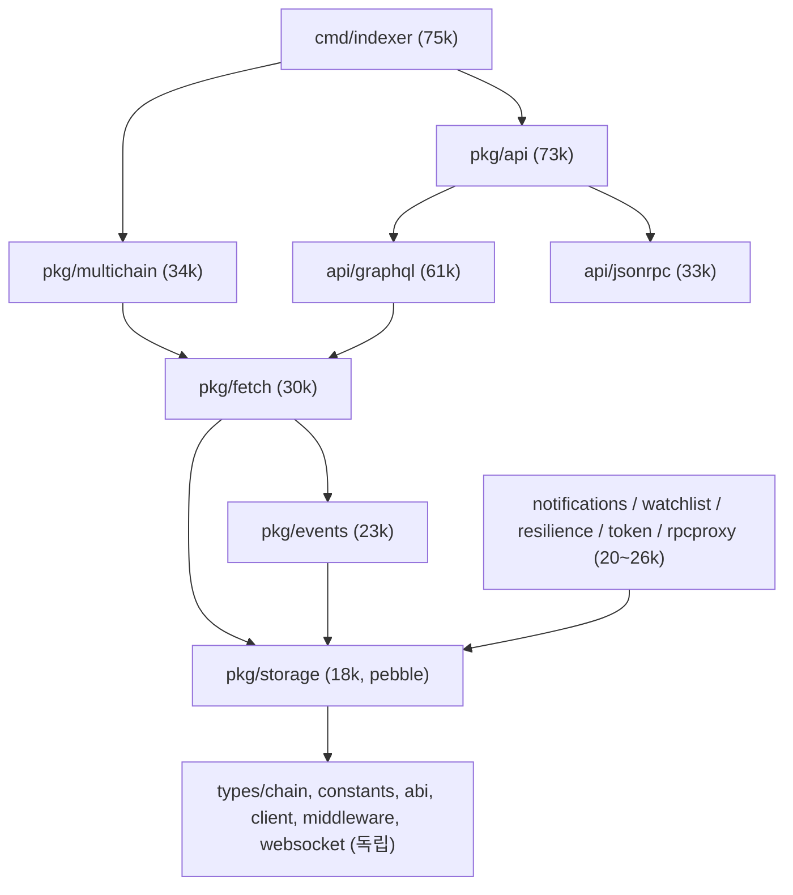
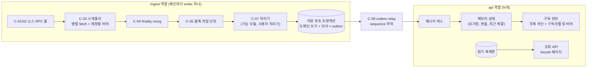

# indexer-go 프레임워크화 리팩토링 작업 정리 (10/3)

다른 프로젝트(nu-54v-dk-toy의 P07 영수증 indexer)가 indexer를 필요로 했지만 `indexer-go`를 쓰지 못했다. 그 일로 `indexer-go`가 "체인 전체를 색인하는 탐색기 하나"로 만들어져 있고 "프로젝트마다 조립해 쓰는 indexer 프레임워크"는 아니라는 점이 드러났다. 이 문서는 그 판단을 코드로 다시 확인하고, `indexer-go`를 프레임워크로 바꾸기 위한 작업을 정리한다. 상세 설계로 넘어가기 전에 검토받는 것이 목적이다.

입력은 셋이다.
- [구조 검토](structure-review.md)와 [재사용 분석](p07-reuse.md). 다른 저장소에서 작성해 옮겨 온 문서다.
- 이번에 새로 만든 AST 코드 그래프([graph/](graph/README.md)).
- 영역별 코드 정독. 수집, 저장, 이벤트 전달·API, 도메인 기능·설정의 네 영역을 읽었다.

대상은 커밋 `5baff64`이다. 결함마다 확신도를 붙였다.
- **[High]**: 코드나 그래프로 직접 확인했다.
- **[Mid]**: 정독 보고만 있고 이번에 다시 확인하지 않았다.

## 1. 결론

`indexer-go`를 프레임워크로 바꾸는 데 앞서 지금 코드에 데이터 정합성 결함이 있다. 이것을 먼저 고쳐야 한다. 기존 문서는 수집 쪽을 "쓸 만하다"고 평가했지만, 다시 확인해 보니 그 평가는 맞지 않는다.

- **[치명] 데이터 손실·오염.**
  - 재시작하면 주소별 sequence가 0부터 다시 시작해 주소 트랜잭션 색인과 잔액 이력을 덮어쓴다.
  - 블록 하나를 10번 넘는 개별 쓰기로 저장해서 원자적이지 않고, 커서는 NoSync로 기록한다.
  - 재처리하면 잔액 delta와 트랜잭션 수가 두 번 더해진다.
  - 멀티체인 모드에서는 모든 체인이 같은 키에 쓴다.
- **[중요] 기능 대부분이 실제로는 동작하지 않는다.**
  - 기본 모드(단일 체인)에서 저장소를 감싸는 genesis wrapper가 일부 인터페이스를 가린다. 그 결과 시스템 컨트랙트 색인, 합의 통계 조회, token holder 조회, module 조회가 꺼진다.
  - EIP-7702, ERC-4337, ERC-7579 처리기는 만들어져 있지만 연결되어 있지 않다.
  - Redis·Kafka 버스, watchlist, price, resilience, 동적 ABI 등록, `/ws` hub도 연결되어 있지 않다.
- **[중요] 수집은 병렬이 아니다.** 라이브 수집은 블록을 하나씩 처리하는 폴링 루프다. worker pool은 gap 복구에만 쓰인다. 적응형 배치 조정은 호출되지 않는 코드다.

프레임워크화 방향은 기존 문서의 "분해"에 동의한다. 다만 순서는 다음과 같이 권장한다(7절).
1. 정합성 결함 수정과 회귀 시험(Phase 0)
2. 저장 포트 분리(Phase 1)
3. 수집 파이프라인 core와 기능 레지스트리·플래그(Phase 2)
4. 변경 스트림(outbox + sequence)과 구독 엔진(Phase 3)
5. 역할 분리와 PostgreSQL(Phase 4)
6. DEX 기능(Phase 5)
7. 선언형 설정과 SDK(Phase 6)

각 Phase는 기존 기능을 하나씩 새 구조로 옮기는 점진 교체(strangler) 방식으로 진행한다.

---

## 2. 목표와 원칙

요청하신 철학을 검증할 수 있는 목표로 바꾸면 다음과 같다. 수치 목표는 상세 설계에서 정하므로 여기서는 기준의 모양만 적는다.

| ID | 목표 | 통과 기준(상세 설계에서 수치 확정) |
|---|---|---|
| G1 | 체인 확장. 어떤 체인이든 adapter를 더해 붙인다 | 새 EVM 체인을 core 코드를 고치지 않고 adapter 패키지와 설정만으로 붙인다. StableNet 전용 코드는 전부 `stablenet` 프로필 안에 둔다 |
| G2 | 저장소 교체. DB를 바꿀 수 있다 | 같은 저장 포트 계약 시험을 Pebble과 PostgreSQL 어댑터가 모두 통과한다. core와 기능 모듈은 어댑터 패키지를 import하지 않는다 |
| G3 | 실시간·대용량 제공(DEX) | 구독자 수 N, 이벤트율 E에서 push 지연 p99 ≤ X ms. 느린 구독자가 다른 구독자의 지연에 영향을 주지 않는다 |
| G4 | 데이터 무손실 | 수집 프로세스를 아무 지점에서 죽였다 다시 켜도, 저장된 결과가 한 번에 끝까지 색인한 결과와 같다(결정성 시험). 구독자는 sequence로 빠진 구간을 다시 받는다 |
| G5 | 프레임워크화 | 필수 기능은 항상 켜지고 옵션 기능은 플래그로 켜고 끈다. 사용자 처리기를 core를 고치지 않고 등록한다. P07을 설정과 처리기 하나로 재현한다 |

이 다섯 목표는 서로 의존한다. G4가 G3의 전제다. sequence와 원자적 commit이 없으면 재동기화도 수평 확장도 정확하지 않다. G2는 G5의 전제다. 기능 모듈이 Pebble 구현에 붙어 있으면 모듈 단위로 켜고 끌 수 없다.

---

## 3. AST 코드 그래프

### 3.1 만든 방법과 규모

`golang.org/x/tools/go/packages`로 모듈 전체를 타입 정보까지 읽었다. 시험 파일은 뺐다. 도구는 `tools/astgraph`, 산출물은 `docs/analysis/graph/`에 있다.

| 항목 | 수 |
|---|---|
| 패키지 | 42 |
| 함수 / 메서드 / 타입 / 인터페이스 | 763 / 1,737 / 520 / 94 |
| 간선 | 호출 2,583, 인터페이스 호출 635, 참조 7,896, 구현 156, import 103, 외부 import 79 |
| `cmd/indexer`가 끌어오는 코드 | 75,574줄(34개 패키지) |

이 수치는 기존 문서(패키지 42, 함수 763, 메서드 1,737, 타입 614, 구현 156)와 일치한다.

### 3.2 층 구조

import 폐포 크기로 보면 층이 넷이다.

`pkg/storage` 하나를 13개 패키지가 import한다. 이 패키지를 import하면 Pebble이 함께 들어온다. `pkg/storage`보다 위에 있는 패키지는 모두 Pebble에 묶인다.

### 3.3 결합 지표

| 지표 | 값 | 뜻 |
|---|---|---|
| `pkg/storage`의 인터페이스 | 43개 | 소비자는 대부분 좁은 인터페이스를 쓴다(좋은 점) |
| `Storage` 인터페이스 메서드 | 152개(23개 인터페이스를 embed) | 어댑터를 새로 쓰려면 152개를 구현해야 한다 |
| `PebbleStorage` 메서드 | 238개, 41개 인터페이스 구현 | 모든 도메인이 구현 하나에 모여 있다 |
| genesis wrapper 메서드 | 33개 인터페이스만 구현 | 8개 인터페이스가 가려진다(4.2절 F1) |
| 저장소 밖에서 `KVStore`를 직접 호출 | 59곳(notifications 21, resilience 23, watchlist 15) | 저장 키 설계가 패키지 밖으로 새어 나간다 |
| `*storage.PebbleStorage` 타입 단언 | 6곳(graphql 5, cmd 1) | 인터페이스를 우회한다 |
| `pkg/storage`의 `fmt.Sprintf` / JSON 호출 | 204 / 76 | 문자열 키 생성과 JSON 직렬화 비용이 크다 |
| `Fetcher` 선언 폐포 | 327개 선언, 7,594줄 | 수집기는 events와 storage 없이는 떼어 낼 수 없다 |
| 독립 부품 폐포 | middleware.RateLimit 128줄, abi.NewDecoder 215줄 | 그대로 재사용할 수 있다 |

### 3.4 동시성 분포

| 패키지 | go문 | select | 채널 연산 | Lock | Sleep | atomic |
|---|---|---|---|---|---|---|
| pkg/eventbus | 10 | 5 | 10 | 7 | 0 | 128 |
| pkg/fetch | 5 | 12 | 21 | 19 | 5 | 0 |
| pkg/multichain | 6 | 7 | 14 | 18 | 0 | 16 |
| pkg/notifications | 5 | 6 | 11 | 12 | 0 | 0 |
| pkg/rpcproxy | 3 | 5 | 8 | 31 | 0 | 14 |
| pkg/storage | 0 | 2 | 2 | 21 | 0 | 162 |

수집(`pkg/fetch`)의 `time.Sleep` 5곳은 모두 context를 확인하지 않는다. `pkg/storage`에는 고루틴이 없다. 동시성 제어는 외부 호출자에게 맡겨져 있다.

---

## 4. 기존 문서 재검증과 새로 찾은 결함

### 4.1 기존 문서 주장의 재검증

| 주장 | 판정 | 근거·정정 |
|---|---|---|
| 저장소 인터페이스 43개, 구현체 메서드 238개 | 맞음 [High] | 그래프 |
| GraphQL 타입 단언 5곳 + cmd 1곳 | 맞음 [High] | `resolvers_consensus.go:115,183,245,282,306`, `main.go:398`. 추가로 확인한 사실: 기본 모드에서는 이 단언이 **항상 실패**한다(F1) |
| 다른 패키지가 KV에 직접 접근(40여 곳) | 맞음, 정정 [High] | 4곳이 아니라 3개 패키지 59곳이다. `cmd/indexer`는 KVStore를 꺼내 notifications에 넘길 뿐 직접 쓰지 않는다 |
| `database.readonly` 무시 | 맞음 [High] | `main.go:375,1061` |
| 블록·트랜잭션 키 `%d` | 맞음 [High] | `schema.go:215,221`. 범위 함수는 시험에서만 쓰이고, 시험 값(100, 200)의 자릿수가 같아 결함을 잡지 못한다 |
| gqlgen을 import하지 않는다 | 부분 정정 [High] | `tools/tools.go`가 도구 고정용으로 import하고 `make generate`가 실행한다. 런타임은 `graphql-go`다. 프로젝트 CLAUDE.md의 "gqlgen 코드 생성"은 현실과 다르다 |
| 저장소 구현이 Pebble 하나다 | 맞음, 보충 [High] | `backend.go`에 KV 수준 `Backend`와 레지스트리가 있지만 호출자가 없다. 이 추상화는 KV 수준이어서 PostgreSQL에는 맞지 않는다 |
| "수집 패턴(worker pool, 적응형 배치, backoff, gap 복구)은 좋다" | **틀림** [High] | 라이브 루프(`fetcher.go:693-751`)는 순차 처리다. worker pool은 gap이 10블록을 넘을 때만 쓴다. 적응형 조정은 호출되지 않는다. worker pool은 오류가 나면 고루틴이 샌다(C1) |
| "멱등 저장과 커서 있음(블록 단위)" | **틀림** [High] | 블록 쓰기는 원자적이지 않고 재처리는 멱등이 아니다(D1~D3) |
| "4337, 7702, Kafka·Redis 버스까지 있어 기능이 풍부하다" | **과대평가** [High] | 처리기와 버스는 있지만 연결되지 않았다(F2, F3) |
| gap 복구 폐포 5,997줄 | 계산 규칙에 따라 다름 [High] | 타입 메서드까지 포함하면 7,479줄이다. 결론(수천 줄이 딸려 온다)은 같다 |
| reorg 감지 없음 | 맞음 [High] | `DeleteBlock`을 부르는 곳이 없다. finalized·safe 태그도 쓰지 않는다 |
| 페이지는 offset으로 자른다 | 맞음, 보충 [Mid] | 목록 질의 전부가 iterator skip이거나 전부 읽은 뒤 slice로 자른다. 게다가 GraphQL `transactions`/`logs`는 범위를 주지 않으면 0..latest 전체 블록을 메모리에 올린다(P1) |
| EventBus 선형 탐색, 버퍼가 차면 버림 | 맞음 [Mid] | `events/bus.go:234-291,277-284`. sequence가 없고, replay는 종류가 섞인 최근 100건뿐이다 |
| 문제 3: 수집 대상 설정이 없고, 블록 전체를 처리하며, 사용자 처리기 연결점이 없다 | 맞음, 보충 [High] | 가장 가까운 연결점은 `fetch.BlockProcessor`(`fetcher.go:309`)다. 그러나 main.go를 고쳐야 등록할 수 있고, gap 복구와 멀티체인 경로에서는 호출되지 않는다. `events.ParserRegistry`와 `EventPipeline`은 인터페이스만 있고 수집 경로가 쓰지 않는다. 해소 작업은 C-07, R2-5, R6-1이다 |
| DEX 평가: 배포 [치명], 도메인 상태 [치명] | 동의 | 각각 R4-1(역할 분리)과 R5-2·R5-3(호가창, 캔들)에서 다룬다. 다만 DEX를 붙이기 전에 정합성(D1~D4)이 먼저 [치명]이다 |
| DEX 평가: 키·직렬화 [중요] | 동의, 보충 [High] | 값 형식은 JSON과 RLP 둘이 아니라 셋(JSON, RLP, 직접 만든 이진 형식)이 섞여 있다. 해소 작업은 R1-3이다 |
| DEX 평가: 수집 패턴 "좋음, 재사용" | **틀림** [High] | 위 "수집 패턴" 행과 4.3절을 보라 |
| 결론의 방향("더 많은 기능이 아니라 분해") | 동의 | 다만 분해보다 정합성 수정이 먼저다 |
| 권장 3 "DEX는 원천 수집만 공유" | 정정 [High] | 권장 2와 독립된 선택지가 아니다. `Fetcher` 선언 폐포가 events와 storage를 포함하므로(7,594줄), 원천 수집을 공유하려면 Phase 1~2(저장 포트 분리, 수집 core 분리)를 먼저 해야 한다. 두 권장은 "분해를 어디까지 할지"라는 범위 문제로 합쳐진다 |

### 4.2 새로 찾은 결함

심각도는 `[치명]`(데이터 손실·오염, 시스템 안정성), `[중요]`(기능 미동작, 장애 가능), `[권장]`으로 매겼다.

#### 데이터 정합성

| ID | 심각도 | 결함 | 위치 | 확신도 |
|---|---|---|---|---|
| D1 | [치명] | 주소 sequence 복원이 빈 함수다. 재시작하면 `addrSeq`가 0부터 시작해 `/index/addr/{addr}/{seq}`와 잔액 이력 키를 **덮어쓴다**. 두 기능이 같은 카운터를 나눠 써서 번호에 빈칸도 생긴다 | `pebble.go:381-386`, `pebble_transactions.go:189-196`, `pebble_historical.go:516` | [High] |
| D2 | [치명] | 블록 하나를 10번 넘는 개별 쓰기로 저장하고, Sync와 NoSync가 섞여 있다. 커서(`SetLatestHeight`)는 NoSync라서 crash 뒤에 커서와 데이터의 순서가 보장되지 않는다. 한 batch로 쓰는 `SetBlockWithReceipts`는 있지만 아무도 부르지 않는다 | `fetcher.go:354-424`, `pebble_blocks.go:40-50,158` | [High] |
| D3 | [치명] | 재처리가 멱등이 아니다. `UpdateBalance`는 읽고 delta를 더해 쓰므로 재처리하면 두 번 더해진다. `txCount`가 다시 증가하고, 주소 색인에 새 sequence로 중복 항목이 생긴다 | `pebble_historical.go:480-531`, `pebble_transactions.go:123` | [High] |
| D4 | [치명] (멀티체인을 켤 때) | 모든 체인이 저장소 하나의 같은 키(`LatestHeightKey`, 블록 키 등)에 쓴다. `Chain*Key`는 정의만 있고 쓰이지 않는다. (해소 10/7, R2-8: 체인마다 DB를 따로 둔다) | `multichain/instance.go:28`, `schema.go:1011-1059` | [High] |
| D10 | [치명] | gap 복구가 블록마다 `SetLatestHeight(높이)`를 무조건 기록한다. 그래서 커서가 gap 끝으로 되돌아가고, 이어지는 `Run`이 gap 뒤의 이미 색인된 블록을 모두 다시 처리한다. 재처리는 멱등이 아니므로(D3) `--gap-recovery`로 시작할 때 gap이 있으면 데이터가 오염된다 | `fetcher_gaps.go:320-365`, `fetcher.go:645`, `fetcher_processing.go:322-350` | [High] |
| D11 | [중요] | 시스템 컨트랙트 조회 10개(Mint, Burn, MinterHistory, MinterConfigHistory, GasTip, Validator, EmergencyPause, DepositMint, Blacklist, MemberHistory)가 데이터를 RLP·이진 형식으로 쓰고 JSON으로 읽는다. 데이터가 한 건이라도 있으면 조회가 decode 오류로 실패한다. F1 때문에 데이터가 저장되지 않아 드러나지 않았다. P0-9에서 발견해 수정했다 | `pebble_system_contracts_impl.go` | [High] |
| D12 | [중요] | gap을 뒤에 있는 블록보다 나중에 채우면, 처리 순서에 따라 결과가 달라지는 상태가 틀어진다. 잔액 이력 순서, 모듈 설치·해제 상태(해제가 설치보다 먼저 처리되어 최종 상태가 "활성"으로 남음) 등이다. 원자적 경로는 커서를 연속으로만 전진시켜 새 gap을 만들지 않지만, 기존 DB의 gap을 채우는 경우에는 남는다. 순서 보장은 R2-2(스케줄러)에서, 기존 DB는 재색인으로 해결한다. (10/6) gap 복구는 순서 의존 기능이 켜져 있으면 색인된 블록 아래의 gap을 채우지 않고 `ErrGapBelowIndexed`로 멈춘다(재색인 안내). 순서 무관 기능만 켜진 경우에만 채운다 | `fetcher_gaps.go`, 순서에 의존하는 처리기들 | [High] |
| D13 | [치명] (StableNet) | fee delegation 트랜잭션(type 0x16)을 클라이언트가 안쪽 송신자 트랜잭션(type 2)으로 바꿔 decode한다. 그래서 트랜잭션과 fee delegation 메타가 체인에 없는 hash로 저장된다. receipt는 실제 hash로 저장되지만 type 0x16이라 다시 읽을 때 decode에 실패한다. 결과적으로 실제 hash로는 트랜잭션도 receipt도 조회할 수 없고, 이 트랜잭션의 Transfer 로그도 ERC-20 transfer 색인에서 빠진다. 로컬 go-stablenet 네트워크에서 확인했다 **해결(10/4, 체인 프로필 CP-3·CP-4 S4):** 기본 수집 경로가 노드의 원시 JSON을 StableNet 프로필로 decode하고 모델 그대로 저장한다. 실제 hash로 트랜잭션·receipt·fee delegation 메타가 조회되고, fee payer 주소 색인과 로그 색인이 채워진다. `TestLiveStableNetIdentity`로 확인했다. `indexer.profile_source: false`(기존 클라이언트 경로)는 결함이 그대로다 | `pkg/adapters/factory/client.go`(raw 경로), `pebble_receipts.go` | [High] |
| D14 | [중요] (StableNet) | 노드 감지가 실제 go-stablenet 바이너리의 client version(`Gstable/v1.1.0-…`)을 알아보지 못했다. 그래서 StableOne adapter가 선택되지 않았고 fee delegation 처리도 꺼졌다. P0 검증 중 수정했다 | `pkg/adapters/detector/detector.go` | [High] |
| D15 | [치명] (StableNet) | WBFT extra 해석이 실제 header에서 모두 실패해 WBFT 데이터(seal, 서명자, epoch)가 하나도 저장되지 않았다. `WBFTExtraRLP.DecodeRLP`가 go-stablenet에서 복사한 코드인데, 지역 구조체의 `rlp:"nil"` 태그가 빠져 있었다. P0 검증 중 수정했다 | `pkg/storage/wbft_parser.go` | [High] |
| D16 | [치명] (StableNet) | 블록 hash를 go-ethereum 규칙(`header.Hash()`)으로 계산한다. StableNet(WBFT)은 현재 라운드의 seal을 비우고 round를 0으로 바꾼 header로 hash를 계산하므로, genesis를 뺀 모든 블록이 실제와 다른 hash로 저장된다. 블록 hash 색인으로 조회하면 실제 hash로는 찾을 수 없다. 체인 프로필 CP-2에서 규칙을 구현했고, 수집 경로에 연결하는 것은 CP-3이다 **해결(10/4, S4):** 블록, WBFT 메타, setcode·userop 기록이 노드의 블록 hash를 쓴다. live 체인을 색인한 DB 전체에서 go-ethereum 규칙 hash가 나오지 않는다. **CP-5(10/4):** GraphQL·JSON-RPC 응답의 블록 hash와 0x16 거래의 hash·type·feePayer도 체인 값이다 | `pkg/fetch`, `pkg/storage`(블록 hash 색인) | [High] |
| D17 | [중요] | receipt를 go-ethereum 합의 인코딩(status, 누적 가스, bloom, 로그 본문)으로 저장해 나머지 필드를 버렸다. 그래서 API의 receipt `transactionIndex`가 항상 0이었고, 로그의 `blockNumber`·`logIndex`·`transactionIndex`도 0이었다. schema v2(모델 인코딩)에서 고쳤고, GraphQL golden의 `receiptsByBlock`으로 고정했다 | `pkg/storage/encoder.go` | [High] |
| D18 | [중요] | `GetBlockByTimestamp`의 iterator에 상한이 없어, 마지막 블록보다 늦은 timestamp를 찾으면 timestamp 색인 밖의 다음 키(`/meta/...`)를 높이로 읽어 엉뚱한 블록을 돌려줬다. schema 키를 추가하면서 드러났고, 상한을 넣어 고쳤다 | `pkg/storage/pebble_historical.go` | [High] |
| D19 | [중요] | 잔액 추적이 가스비를 `gasUsed × tx.GasPrice()`로 계산했다. EIP-1559 계열 거래에서 `GasPrice()`는 fee cap이라 실제 지불액(receipt의 `effectiveGasPrice`)보다 크게 차감했고, type 0x16의 가스를 fee payer가 아니라 송신자에게 차감했다. S4에서 receipt의 실제 가격으로, 부담자는 fee payer로 고쳤다. live 체인의 0x16 거래 6건에서 계정별 기록 변화량이 기대값과 같다 | `pkg/fetch/fetcher_indexing.go` | [High] |
| D20 | [중요] | 주소별 거래 색인과 잔액 이력이 주소 하나당 순번 카운터 하나를 함께 썼다(`nextAddrSeq`). 그래서 한쪽을 끄거나 나중에 켜면 다른 쪽 키의 번호가 바뀌었다. 기능을 따로 켜고 끄거나 나중에 그 기능만 다시 처리(backfill, R2-7)할 수 없는 구조였다. 기능 레지스트리 F5에서 기능마다 꺼 보는 시험으로 드러났고, 카운터를 키 묶음별로 나눠 고쳤다(schema v2는 배포 전이라 같은 버전에서 바꿨다) | `pkg/storage/block_tx.go` | [High] |
| D21 | [치명] (StableNet) | 시스템 컨트랙트 이벤트 키에 log 위치가 없었다. mint·burn·가스 팁·멤버 변경·긴급 정지·제안 수 상한·실행 건너뜀·권한 계정 이벤트는 거래 인덱스(일부는 log 인덱스까지)를 코드에서 0으로 고정했다. minter 설정·검증자 변경·blacklist는 (주소, 블록)만 썼다. 그래서 같은 블록에서 같은 종류의 이벤트가 두 번 나오면 앞 이벤트가 덮어써져 사라졌다. 이벤트에 거래·log 인덱스를 담고 키를 (블록, log 위치)로 바꿔 고쳤다 | `pkg/storage/pebble_system_contracts_impl.go`, `schema.go` | [High] |
| D22 | [중요] (StableNet) | minter·burner로 거른 mint·burn 조회는 `/index/syscontracts/mint_minter/`·`burn_burner/` 색인을 읽는데, 이 색인을 쓰는 코드가 없었다. 그래서 거른 조회는 항상 빈 결과였다. 이벤트를 저장할 때 색인도 쓰도록 고쳤다 | `pkg/storage/pebble_system_contracts_impl.go` | [High] |
| D5 | [중요] | 로그 색인, 주소·잔액 색인, 블록 처리기, 시스템 컨트랙트 파서의 실패를 경고 로그로만 남긴다. 커서는 그대로 전진해서 색인에 빈칸이 영구히 남는다 | `fetcher_processing.go`, `fetcher_indexing.go` | [Mid] |
| D6 | [중요] | gap 복구 경로(`FetchRangeConcurrent`)는 시스템 컨트랙트 파싱, 로그 이벤트, 블록 처리기를 건너뛴다. 복구한 블록은 라이브 블록보다 덜 색인된다. (해소 10/7: 모든 경로가 한 파이프라인을 쓴다, R2-2) | `fetcher.go:476-690` | [Mid] |
| D7 | [중요] | 큰 블록은 주소 색인, transfer, SetCode, UserOp 처리를 두 번 한다 | `large_block.go:194-235` | [Mid] |
| D8 | [중요] | 블록 이벤트를 receipt 저장 전에 발행한다. 발행 버퍼가 차면 이벤트를 버리고, outbox가 없다. 이벤트를 받은 클라이언트가 아직 저장되지 않은 receipt를 조회할 수 있다. (해소 10/7: commit 뒤 발행은 Phase 0, 버퍼가 찼을 때의 유실과 프로세스가 죽었을 때의 유실은 R3-1 outbox) | `fetcher.go:387 대 397`, `events/bus.go:330-346` | [Mid] |
| D9 | [중요] | 잠금 없이 읽고-수정하고-쓰는 카운터가 있다(holder 수, total supply, setcode·module·bundler 통계, notification 통계). 지금은 라이브 루프가 순차라서 잠재 결함이지만, 병렬 commit을 도입하는 순간 race가 된다 | `pebble_token_holder.go:380-465`, `pebble_system_contracts_impl.go:341-372` 등 | [Mid] |

#### 기능 미동작(연결 누락)

| ID | 심각도 | 결함 | 위치 | 확신도 |
|---|---|---|---|---|
| F1 | [중요] | 단일 체인 모드에서 저장소를 `GenesisInitializingStorage`로 감싼 뒤 fetcher와 API에 넘긴다. wrapper가 `Storage` 인터페이스만 embed하므로 `SystemContractWriter`, `TokenHolderIndex*`, `ModuleIndex*`, `*PebbleStorage` 단언이 실패한다. 그 결과 시스템 컨트랙트 이벤트(mint, burn, governance) 색인이 꺼지고, 합의 통계, token holder, module GraphQL 조회는 오류를 낸다 | `main.go:299-304,398-399`, `fetcher.go:212`, 그래프 implements 비교 | [High] |
| F2 | [중요] | EIP-7702(`SetSetCodeProcessor`), ERC-4337(`SetUserOpProcessor`), ERC-7579(`NewModuleProcessor`)를 부르는 곳이 없다. 따라서 GraphQL의 UserOp, SetCode, Module 조회는 항상 비어 있다. fee delegation은 `*client.Client`가 `FeeDelegationClient`를 구현하지 않아서 동작하지 않는다 | `fetcher.go:287-303`, `fetch/module.go:30` | SetCode·UserOp·Module은 [High], fee delegation은 [Mid] |
| F3 | [권장] | 연결되지 않은 패키지·부품: `pkg/eventbus`(Redis, Kafka, factory), watchlist, price, resilience, `crypto/bls`, 동적 ABI 등록(`ContractRegistrationService`), JSON-RPC pending pool, `/ws` hub, rpcproxy queue·worker, 적응형 배치 | 정독 보고, `price`·`bls` import 없음 확인 | [Mid] |
| F4 | [중요] | 무시되는 설정이 있다. `database.readonly`, `eventbus.*`, `node.*`, `watchlist.*`, `resilience.*`, `account_abstraction.*`, `api.enable_websocket_keepalive`, 체인별 `workers`/`batch_size`가 그렇다. `--workers`는 기본값 100이 항상 설정 파일 값을 덮는다. bool 플래그는 켜기만 할 수 있다 | `main.go:181-203,949`, `config.go` | readonly는 [High], 나머지는 [Mid] |

#### 동시성·안정성

| ID | 심각도 | 결함 | 위치 | 확신도 |
|---|---|---|---|---|
| C1 | [중요] | `FetchRangeConcurrent`가 첫 오류에서 바로 반환한다. 결과 채널 버퍼가 worker 수와 같아서, 남은 worker와 job 생산자가 영구히 막힌다(고루틴 누수) | `fetcher.go:500-551` | [High] |
| C2 | [중요] | GraphQL WebSocket 문제 셋. (1) 클라이언트가 보낸 `id`를 버스 전역 subscription ID로 그대로 쓴다. 두 클라이언트가 같은 `"1"`을 쓰면 서로의 구독을 덮어쓰고 해제한다. (2) cleanup이 `close(c.send)`를 호출하는데 다른 고루틴이 아직 보낼 수 있어 panic이 날 수 있다. (3) keepalive가 꺼진 기본 설정에서는 약 60초 뒤 연결이 끊긴다 | `subscription.go:341,1166,136-200` | (1)(2)는 [High], (3)은 [Mid] |
| C3 | [중요] | `GetAllSubscriberInfo`가 RLock을 잡은 채로 다시 RLock을 잡는다. writer가 대기 중이면 deadlock이 난다. `GET /subscribers`로 도달할 수 있다 | `events/bus.go:540-545` | [High] |
| C4 | [권장] | 수집 경로의 `time.Sleep`이 context를 무시해서 종료가 늦다. RPC 호출에는 timeout이 없어 멈출 수 있다 | `fetcher.go:715,725,744`, `fetcher_processing.go` | `Sleep`은 [High], timeout은 [Mid] |
| C5 | [권장] | `/ws` hub가 RLock만 잡고 map에서 삭제한다. rate limiter는 잠금 밖에서 `lastAccess`를 쓴다. 둘 다 data race다 | `websocket/hub.go:108-121`, `middleware/ratelimit.go:69-73` | [Mid] |
| C6 | [권장] | notifications가 키가 없을 때 `nil, nil`을 기대하지만, KVStore는 `ErrNotFound`를 돌려준다. 새 설정의 통계 갱신이 항상 실패한다 | `notifications/storage.go:36-42`, `pebble.go:296` | [Mid] |

#### 보안·운영(공개 API 기준)

| ID | 심각도 | 결함 | 확신도 |
|---|---|---|---|
| S1 | [중요] | rate limit이 X-Forwarded-For의 맨 왼쪽 값을 신뢰해서 클라이언트가 위조할 수 있다. rate limit과 API key는 기본값이 꺼짐이다. Origin이 없으면 CORS가 `*`와 credentials를 함께 돌려준다. WebSocket `CheckOrigin`은 항상 true다. GraphQL에 깊이·복잡도 제한이 없다. 공개 DEX API로 쓰려면 모두 고쳐야 한다 | [Mid] |

#### 성능

| ID | 심각도 | 결함 | 확신도 |
|---|---|---|---|
| P1 | [중요] | GraphQL `transactions`/`logs`는 범위를 주지 않으면 0..latest 전체 블록을 읽어 메모리에서 거르고 자른다 | [High] (`resolvers.go:432-441,412`) |
| P2 | [중요] | 목록 질의가 전부 offset 방식이다. `GetLogs`는 결과 수에 상한이 없다 | [Mid] |
| P3 | [중요] | 이벤트마다 구독자 전체를 선형으로 훑고, 구독자마다 `time.Now`, 지표 기록, JSON 직렬화를 한다 | [Mid] |
| P4 | [권장] | rpcproxy 캐시의 `Get`이 배타 잠금을 잡고, rate limiter 하나를 전체 클라이언트가 공유한다. singleflight도 없다 | [Mid] |

### 4.3 재검증 결과가 계획에 주는 영향

기존 문서는 "수집은 재사용하고 제공 쪽을 바꾼다"고 정리했다. 재검증해 보니 수집 쪽도 그대로 재사용할 수 없다. 원자적 commit, 멱등성, 순서 보장, 고루틴 수명이 모두 빠져 있기 때문이다. 재사용할 수 있는 것은 패턴의 착상(블록 높이 순서로 commit하는 재정렬, backoff)과 독립 부품(middleware, abi, client, websocket 직렬화 부분) 정도다. 그래서 7절의 Phase 0는 리팩토링과 상관없이 지금 `main`에 필요한 수정이다.

---

## 5. 인덱서 기능 카탈로그(필수 / 옵션)

### 5.1 나눈 기준

"필수"는 이것이 없으면 정확한 indexer가 아닌 기능이다. 어떤 프로젝트든 쓰고, 끌 수 없다. "옵션"은 프로젝트에 따라 필요가 갈리는 기능이다. 이렇게 나누면 체인 전체 원천 데이터 저장(탐색기 기능)이 옵션이 된다. 그래야 P07처럼 이벤트 하나만 필요한 프로젝트가 체인 전체를 저장하지 않고 쓸 수 있다.

### 5.2 필수 기능(core)

| ID | 기능 | 하는 일 | indexer-go 현황 |
|---|---|---|---|
| C-01 | 체인 소스 adapter | 블록·receipt·로그를 가져오고 head를 따라간다(`newHeads` 구독 + 폴링 보조). 노드 종류를 감지한다 | 있음(adapter, detector). 폴링만 하고 구독은 쓰지 않는다 |
| C-02 | RPC 연결 관리 | 엔드포인트 여러 개 사이 failover, 호출별 timeout, 속도 제한, 회로 차단기 | 없음(엔드포인트 하나, timeout은 dial에만) |
| C-03 | 수집 스케줄러 | 크기가 정해진 worker pool로 병렬 fetch, 높이 순서대로 commit(재정렬 버퍼), backpressure, backoff 재시도 | 일부(gap 복구에만 있고 누수 결함 C1이 있다) |
| C-04 | finality·reorg 관리 | 확정 정책(즉시 확정 / n confirmation / finalized 태그), parent hash 사슬 확인, reorg 때 undo 기록으로 되돌리고 보상 이벤트를 낸다 | 없음 |
| C-05 | 블록 작업 단위(Unit of Work)와 체크포인트 | 블록(또는 블록 묶음) 하나의 모든 쓰기, 커서, outbox를 한 트랜잭션으로 commit한다. 재처리는 멱등이다 | 없음(D1~D3) |
| C-06 | gap 감지·backfill·재색인 | 시작할 때와 주기적으로 gap을 찾아 채운다. 지정 높이부터 다시 색인한다. 기능을 새로 켜면 그 기능만 backfill한다 | 일부(시작할 때만, 경로마다 결과가 다르다 D6) |
| C-07 | 처리기 레지스트리와 디코딩 | 기능 모듈과 사용자 처리기를 등록하는 공개 SPI. ABI 기반 이벤트·함수 decode. 블록 안의 처리 순서를 보장한다 | 없음(처리기는 코드에 박혀 있다). ABI decoder는 있다 |
| C-08 | 저장 포트와 기본 어댑터 | 도메인 단위 포트, 스키마 버전과 migration, 어댑터 계약 시험 | 없음(Pebble 구현 하나에 포트가 섞여 있다) |
| C-09 | 변경 스트림 | transactional outbox, 스트림별 단조 증가 sequence, at-least-once 발행과 소비자 쪽 중복 제거 | 없음(D8) |
| C-10 | 블록 헤더와 상태 조회 | reorg 판정용 헤더 저장, 수집 상태(cursor, lag, finalized height) 조회 | 일부 |
| C-11 | 기능 플래그와 설정 시스템 | 우선순위가 일관된 설정(기본값 < 파일 < 환경 변수 < CLI), 기능 의존성 검증, 무시되는 키가 없다 | 일부(F4) |
| C-12 | 관측성 | 지표(cursor, lag, RPC, 처리 시간, 큐 깊이, 버린 이벤트 수), 구조화 로그, 추적 | 일부(추적 미미) |
| C-13 | 수명 관리 | context 전파, graceful shutdown, 고루틴 수명 관리(errgroup), health와 readiness | 일부(C1, C4) |
| C-14 | 실행 역할 | `ingest`(체인마다 writer 하나), `api`(N개, 읽기 전용), `all`(개발용) | 없음 |

### 5.3 옵션 기능(feature flag)

플래그 이름은 제안이다. "기본값"은 탐색기 프로필 기준이다.

| 묶음 | 플래그 | 기능 | 의존 | 현황 |
|---|---|---|---|---|
| 원천 데이터 | `raw.transactions` | 트랜잭션·receipt 저장과 hash 조회 | — | 있음 |
| | `raw.logs` | 로그 저장과 (address, topic0~3, block) 색인 | raw.transactions | 있음(topic1~3은 메모리에서 거른다) |
| | `raw.traces` | 내부 호출(trace) 수집 | raw.transactions | API 요청 때만(수집하지 않는다) |
| | `raw.mempool` | 대기 트랜잭션 구독 | — | 연결 안 됨 |
| 주소·잔액 | `address.index` | 주소별 트랜잭션 색인, 컨트랙트 생성 | raw.transactions | 있음(D1) |
| | `balance.native` | native 잔액 이력 | address.index | 있음(D1, D3) |
| | `balance.statediff` | storage diff | raw.traces | 없음 |
| 토큰 | `token.transfers` | ERC-20/721/1155 transfer 색인 | raw.logs | 20·721만 있고 1155는 없다. topic 수로 표준을 추정한다 |
| | `token.metadata` | 토큰 메타데이터 | token.transfers | 있음(단일 체인만) |
| | `token.holders` | 보유자·잔량 | token.transfers | 호출자 없음 |
| 계정 추상화 | `aa.erc4337` | UserOp, bundler, paymaster | raw.logs | 연결 안 됨(F2) |
| | `aa.erc7579` | 모듈 설치·해제 | raw.logs | 연결 안 됨 |
| | `aa.eip7702` | SetCode 인가 | raw.transactions | 연결 안 됨 |
| 컨트랙트 | `contract.abi_registry` | ABI 등록과 동적 이벤트 decode | — | 연결 안 됨 |
| | `contract.verification` | 소스 검증(solc) | — | 있음 |
| | `contract.proxy` | EIP-1967 프록시 인식 | — | 없음 |
| StableNet 프로필 | `stablenet.fee_delegation` | fee delegation(type 0x16) | raw.transactions | 동작 안 함(F2) |
| | `stablenet.system_contracts` | mint, burn, governance, blacklist | raw.logs | 단일 체인에서 꺼짐(F1) |
| | `stablenet.wbft` | WBFT 합의, epoch, 검증자 서명 통계 | — | 있음(조회는 F1) |
| DeFi·DEX | `dex.pools` | 풀·시장 등록, 유동성 상태 | contract.abi_registry | 없음 |
| | `dex.trades` | 체결 스트림 | dex.pools | 없음 |
| | `dex.orderbook` | 호가창(L2 깊이)과 변화분 | dex.pools | 없음 |
| | `agg.candles` | OHLCV 캔들(1m, 5m, 1h, 1d 등) | dex.trades | 없음 |
| | `agg.timeseries` | 일·주·월 합계 등 시계열 집계 | — | 없음 |
| | `price.oracle` | 가격 | — | 연결 안 됨 |
| 제공 | `api.graphql` | 탐색 조회 | — | 있음 |
| | `api.jsonrpc` | Ethereum 호환 RPC, filter | — | 있음(`eth_subscribe` 없음) |
| | `api.etherscan` | Etherscan 호환 | — | 있음 |
| | `api.rest` | 고빈도 경로용 단순 REST | — | 없음 |
| | `api.stream` | WebSocket 스트림(snapshot + delta + sequence) | C-09 | 없음(지금 구독에는 결함 C2가 있다) |
| | `api.rpcproxy` | 노드 RPC 프록시와 캐시 | — | 있음 |
| 연계 | `bus.kafka` / `bus.redis` / `bus.nats` | 외부 메시지 버스로 스트림을 내보낸다 | C-09 | 연결 안 됨 |
| | `notify.webhook` / `notify.email` / `notify.slack` | 알림 | C-09 | 있음(유입 단계에서 유실될 수 있다) |
| | `watchlist` | 주소 감시 | C-09 | 연결 안 됨 |
| 운영 | `multichain` | 여러 체인을 한 프로세스에서 | C-08의 체인 네임스페이스 | 해소(R2-8, 체인별 DB) |
| | `retention.pruning` | 보존 기간이 지난 데이터 삭제 | — | 없음 |
| | `ops.snapshot` | 스냅샷·백업 | — | 없음 |

### 5.4 플래그 방식

- **선언.** YAML의 `features.<name>.enabled`, 환경 변수 `INDEXER_FEATURES_<NAME>_ENABLED`, CLI의 `--feature <name>=on|off`로 켜고 끈다. 우선순위는 C-11을 따른다. CLI로 끌 수도 있어야 한다(지금은 켜기만 된다).
- **프로필.** `explorer`, `stablenet`, `dex`, `minimal` 같은 묶음을 기본값 세트로 두고, 개별 플래그로 덮는다.
- **의존성 검증.** 시작할 때 기능 의존 그래프를 확인한다. 의존 기능이 꺼져 있으면 오류를 내고 멈춘다. 지금처럼 조용히 꺼지면 안 된다.
- **기능 모듈 계약.** 각 기능은 `Feature` 인터페이스(`Name`, `Requires`, `Register(Registrar)`)를 구현한다. 처리기, 저장 포트, 스키마, API resolver, 지표를 한곳에서 등록한다. 꺼진 기능은 등록하지 않으므로 그 기능의 코드 경로가 실행되지 않는다.
- **켜고 끄는 시점.** 플래그는 재시작할 때만 반영한다(정적). 이미 색인된 DB에서 기능을 새로 켜면 그 기능의 처리기만 시작 높이부터 다시 돌리는 backfill 작업이 필요하다(C-06). 기능을 끄면 데이터는 남기고 갱신만 멈춘다. 이 상태는 API에서 "갱신 중지"로 알려야 한다.

---

## 6. 목표 구조와 DEX 저지연 설계 방향

### 6.1 흐름

### 6.2 패키지 배치(제안)

| 패키지 | 책임 | import 허용 |
|---|---|---|
| `core/model` | 블록, 로그, 이벤트, sequence 같은 공용 타입 | 표준 라이브러리, geth 타입 |
| `core/port` | 저장·소스·버스 포트 인터페이스 | core/model |
| `chain/{evm,stablenet,anvil}` | 소스 adapter, 체인 프로필 | core |
| `ingest` | 스케줄러, 재정렬 버퍼, 작업 단위, finality·reorg | core |
| `pipeline` | 처리기·기능 레지스트리, 플래그, 의존성 검증 | core |
| `features/<name>` | 기능 모듈 하나(처리기 + 포트 + resolver) | core, pipeline |
| `store/{pebble,postgres}` | 저장 어댑터. 키 코덱과 직렬화는 어댑터 안에 숨긴다 | core |
| `stream` | outbox relay, 버스 어댑터, 구독 엔진 | core |
| `serve/{graphql,jsonrpc,rest,ws}` | 제공 계층 | core, features의 resolver |
| `cmd/indexer` | 역할(`ingest`/`api`/`all`)을 조립 | 전부 |

규칙은 하나다. **core와 features는 어댑터 패키지를 import하지 않는다.** 이 규칙은 그래프 도구로 CI에서 검사할 수 있다. `tools/astgraph`에 import 규칙 검사를 더하면 된다.

### 6.3 동시성·자료구조 설계 방향(요청 5)

| 위치 | 문제 | 방향 | 단점 |
|---|---|---|---|
| fetch | RPC 왕복이 지연을 지배한다 | 크기가 정해진 worker pool(`errgroup` + context)과 RPC 풀. 엔드포인트마다 토큰 버킷을 둔다 | RPC 제공자의 속도 제한에 걸리기 쉬워 튜닝이 필요하다 |
| commit 순서 | 병렬 fetch의 결과가 순서 없이 도착한다 | 높이를 키로 하는 min-heap 재정렬 버퍼. 창 크기를 넘으면 fetch를 멈춘다(backpressure) | 앞 블록 하나가 늦으면 창 전체가 기다린다 |
| 처리기 실행 | 기능이 늘수록 블록당 처리 시간이 늘어난다 | 블록 안의 순서를 지키면서 기능을 키(시장, 주소)로 shard한다. shard마다 고루틴 하나가 처리한다(actor). shard 사이는 병렬이다 | shard를 넘나드는 처리(예: 여러 시장에 걸친 라우팅)는 따로 조정해야 한다 |
| 쓰기 | 개별 쓰기와 혼합된 Sync | 블록(또는 N블록)마다 트랜잭션 하나에 도메인 쓰기, 커서, outbox를 함께 commit한다. 키는 고정 길이 big-endian 이진 키, 값은 한 가지 이진 형식으로 쓴다 | 묶는 블록 수가 커질수록 지연이 늘어난다. 키 형식을 바꾸면 재색인이 필요하다 |
| 카운터 | 잠금 없는 읽기-수정-쓰기 | 카운터를 writer 하나(actor)가 소유하거나, 작업 단위 안의 delta를 합쳐 한 번에 쓴다 | 집계값을 실시간으로 읽으면 작업 단위 하나만큼 늦을 수 있다 |
| 발행 | 저장과 발행이 원자적이지 않다 | transactional outbox와 relay. 스트림(체인, 주제)마다 단조 증가 sequence를 매긴다. 소비자는 sequence로 중복을 제거한다 | outbox 테이블 관리와 relay 지연(수 ms)이 추가된다 |
| 구독 매칭 | 이벤트마다 구독자를 선형으로 탐색한다 | 주제별 색인 `map[topic]*subscriberSet`을 `atomic.Pointer`로 copy-on-write한다. 읽는 쪽은 잠금이 없다 | 구독을 추가·해제할 때 복사 비용이 든다(구독 변경이 잦으면 sharded map을 쓴다) |
| 전달 | 구독자마다 JSON을 직렬화하고, 버퍼가 차면 조용히 버린다 | 이벤트마다 한 번만 직렬화해 `[]byte`를 공유한다. 구독자마다 크기가 정해진 링 버퍼를 두고 쓰는 고루틴을 하나 둔다. 버퍼가 넘치면 연결을 끊고 "sequence X부터 다시 받기"를 알린다 | 느린 클라이언트는 재연결 비용을 진다 |
| 재동기화 | 최근 100건만 replay하고 sequence가 없다 | snapshot(sequence S 기준) + delta(S+1부터). 주제마다 최근 delta를 링 버퍼에 보관한다 | 메모리 사용량이 주제 수에 비례한다 |
| 호가창 | 도메인 상태가 없다 | 시장마다 actor 하나가 호가창을 소유한다. 가격 단위 정렬 구조(B-tree 또는 정렬 배열 + 맵)에 두고, 읽는 쪽에는 불변 snapshot을 `atomic.Pointer`로 내보낸다(RCU) | snapshot을 만들 때마다 복사 비용이 든다. 변화분만 계산하는 방식은 구현이 복잡하다 |
| 캔들 | 없음 | 시장·주기마다 시간 bucket 링. 체결 이벤트로 증분 갱신한다 | reorg 때 bucket을 되돌리는 규칙이 필요하다 |
| 조회 | 전체 읽기와 offset | 조건별 복합 색인과 keyset 페이지. 범위·결과 수·질의 비용 상한, 자주 쓰는 조회에는 singleflight와 캐시 | 색인이 늘수록 쓰기 비용과 저장 공간이 늘어난다 |
| 수평 확장 | 임베디드 DB 하나에 프로세스 하나 | ingest는 하나, api는 N개. api는 버스를 소비해 메모리 상태를 만들고, 과거 조회는 읽기 복제본에서 한다 | 버스와 복제 DB를 운영해야 한다. api 노드 사이에 상태가 잠깐 어긋날 수 있다(sequence로 드러낸다) |

언어 선택(Rust 추출)에 대해서는 기존 문서의 판단(지금은 필요 없다)에 동의한다. 위 표의 병목은 모두 자료구조와 구조의 문제이고, Go로 해결할 수 있다. 연산 밀도가 높고 큰 배치로 부를 수 있는 기능이 생기면 그때 다시 검토한다. DEX 경로 탐색, 대량 가격 시뮬레이션, 청산·위험 계산이 그런 기능이다. 이때도 cgo 라이브러리보다 별도 서비스(gRPC)나 배치 작업이 낫다. 이 기능들은 indexer 밖의 소비자로 두고, 변경 스트림(C-09)에서 데이터를 받게 한다. 단점은 네트워크 지연이 추가된다는 것이다.

---

## 7. 리팩토링 작업 목록

각 작업에는 ID, 목표, 범위, 선행 작업, 검증 기준이 있다. 상세 설계는 Phase마다 따로 쓴다.

### Phase 0: 정합성 수정과 안전망

리팩토링과 상관없이 지금 `main`에 필요한 수정이다. 지금 동작을 시험으로 고정해 두고, 이후 Phase의 회귀 기준으로 쓴다.

| ID | 작업 | 선행 | 검증 기준 |
|---|---|---|---|
| R0-1 | 특성 시험(golden). anvil에서 정해진 시나리오를 색인하고 주요 조회 결과를 스냅샷으로 저장한다 | — | 같은 입력이면 같은 스냅샷이 나온다 |
| R0-2 | crash 시험 하네스. 블록 처리 중 임의 지점에서 프로세스를 죽였다 재시작한 결과를 R0-1 스냅샷과 비교한다 | R0-1 | 지금 코드에서는 실패해서 D1~D3을 재현해야 한다 |
| R0-3 | D1 수정. 주소 색인 키를 sequence 대신 `(block, txIndex)`로 바꾸거나, 시작할 때 주소별 최대 sequence를 복원한다 | R0-2 | 재시작한 뒤 덮어쓰기가 없다 |
| R0-4 | D2·D3 수정. 블록 하나를 batch 하나로 쓰고 커서도 같은 batch에 넣는다(Sync). 잔액은 delta 대신 `(block, tx)`를 키로 하는 멱등 쓰기로 바꾸고, 카운터는 파생값으로 만든다 | R0-2 | R0-2 crash 시험을 통과한다 |
| R0-5 | F1 수정. genesis wrapper를 없애고 그 동작을 잔액 기능 안으로 옮긴다. `*PebbleStorage` 타입 단언을 없앤다 | R0-1 | 시스템 컨트랙트 이벤트가 색인되고 합의 통계 조회가 성공한다 |
| R0-6 | F2 연결(9.1절 결정). SetCode, UserOp, Module processor를 fetcher에 등록하고, fee delegation 클라이언트를 고친다. 라이브 경로와 gap 복구 경로 모두에서 동작하게 한다 | R0-1, R0-5 | 시나리오별 GraphQL 조회 결과가 기대값과 같다 |
| R0-7 | C1~C4 수정. 고루틴 누수, WebSocket subscription ID를 연결별 네임스페이스로 분리, `close` panic, keepalive, 재귀 RLock, context를 보는 sleep | — | `go test -race`, goleak 시험 |
| R0-8 | P1 수정. 범위가 없는 조회는 거부하거나 상한을 둔다 | — | 큰 DB에서 조회 시간이 범위에 비례한다 |
| R0-9 | D4 임시 조치. 체인별 키 분리 전까지 `multichain.enabled`면 시작하지 않는다. (R2-8에서 해제) | — | 설정 검증 시험 |
| R0-10 | F4 정리. 무시되는 설정 키를 반영하거나 지우고, CLI 기본값이 설정 파일을 덮는 문제를 고친다. (완료: 명시적 플래그만 적용, 연결 안 된 설정은 시작 시 경고, `database.readonly`는 거부) | — | 설정 우선순위 시험 |

### Phase 1: 저장 포트 분리

| ID | 작업 | 선행 | 검증 기준 |
|---|---|---|---|
| R1-1 | 도메인별 포트를 `core/port`로 옮긴다(블록, 로그, 주소, 토큰, 시스템 컨트랙트 등). `Storage` 합집합은 조립용으로만 남긴다. (완료 10/6: 인터페이스와 값 타입을 `pkg/core/port`로 옮기고 `pkg/storage`의 별칭을 지웠다. API는 `port.QueryStore`를 받고, 합집합에 이미 든 포트로 하는 assertion 64곳을 지웠다. fetch는 `port.Rollbacker`로 Pebble 검사를 대신한다. 시험: `TestPortsImportNoImplementation`, `TestStorageAssemblyOnly`, `TestNoPortAliases`. 후속(10/6): 포트는 체인 중립 모델(`pkg/core/model`)만 주고받는다(`core/types` import 금지 시험). `BlockReader`·`BlockWriter`가 `Reader`·`Writer`에 들어가고 `AsModelReader`, 공개 `Batch`, go-ethereum 쓰기 메서드를 지웠다. fee delegation 메타 저장을 `pkg/chains/stablenet/feedelegation`(`MetaStore`, `port.KV`)으로 옮겼고, `isFeeDelegated` 필터는 `chains.FeeDelegationOf`로 판정한다) | Phase 0 | 포트 패키지가 Pebble을 import하지 않는다(그래프 검사) |
| R1-2 | `KVStore`를 공개 인터페이스에서 빼고, notifications는 자기 포트를 갖게 한다. resilience와 watchlist는 연결하거나 지운다. (완료 10/6: `Storage`에서 `KVStore`를 뺐고, notifications는 `KeyValueStore` 포트와 자기 키·keyspace를 갖는다. resilience·watchlist는 지웠다. 체인 패키지는 `port.KV`를 쓴다) | R1-1 | 저장소 밖의 KVStore 호출이 0곳이다 |
| R1-3 | 키 코덱. 고정 길이 이진 키와 단일 값 형식을 도입하고, 스키마 버전을 기록한다. (K1 완료 10/5: 숫자 키를 고정 자릿수로. K2 보류 10/7: 측정 결과 이득이 작다, 11절) | R1-1 | 키 정렬 속성 시험(무작위 높이에서 사전순과 숫자순이 같다) |
| R1-4 | 어댑터 계약 시험. 포트마다 어떤 어댑터든 통과해야 하는 시험 묶음을 만든다. (완료 10/6: `pkg/core/port/porttest`가 모든 포트 메서드의 계약을 포트만으로 시험하고 Pebble은 `TestPortContracts`로 통과한다. 일부러 틀린 저장소 5종을 잡는지 `TestPortContractsCatchBrokenStores`로 확인한다. 계약 작성 중 찾은 Pebble 결함은 `knownDefect`로 표시하고 따로 고친다) | R1-1 | Pebble 어댑터가 통과한다 |
| R1-5 | keyset 페이지. 목록 포트를 `(cursor, limit)` 방식으로 바꾼다. (완료 10/7: 목록 포트 30개가 `port.Page{After, Limit, Offset}`를 받고 다음 페이지 cursor를 돌려준다. Pebble은 `scanPage`로 key 범위를 읽어 cursor 페이지가 앞쪽 항목을 지나지 않는다(`pageSteps` 시험, 5만 개 목록에서 offset 1.8ms·cursor 3.8µs). GraphQL `PaginationInput.after`와 `pageInfo.endCursor`, JSON-RPC `after`·`nextCursor`. offset은 기존 클라이언트용으로 남는다. 계약은 `checkPaging`. 남은 것: GraphQL `reorgs`는 목록을 그대로 돌려줘 cursor를 내보내지 않고, `GetRecent*`는 limit만 받는다) | R1-1 | 깊은 페이지의 조회 시간이 페이지 위치와 무관하다 |
| R1-6 | `backend.go`(KV 수준 추상화)를 지운다. (완료 10/6) | R1-1 | — |

### Phase 2: 수집 파이프라인 core와 기능 레지스트리

| ID | 작업 | 선행 | 검증 기준 |
|---|---|---|---|
| R2-1 | 소스 SPI와 RPC 풀(failover, timeout, 속도 제한, `newHeads` + 폴링). (완료 10/7: SPI는 `pkg/source`. 풀은 `pkg/rpcpool`로 RPC 클라이언트 아래 HTTP transport에 둬서 모든 노드 호출이 함께 전환된다. `rpc.fallback_endpoints`, `rpc.rate_limit`, `rpc.ws_endpoint`. 검증: 1순위 노드를 끊어도 수집이 끝까지 가고 결과가 한 번에 색인한 DB와 같다(`TestIndexingSurvivesEndpointLoss`), live에서 응답 없는 1순위 뒤 fallback으로 색인(`TestLiveFailover`). newHeads로 live head 지연 p95가 50ms에서 1~2ms) | Phase 1 | 엔드포인트 하나를 끊어도 수집이 계속된다 |
| R2-2 | 스케줄러(errgroup worker pool, 재정렬 버퍼, backpressure). 라이브 수집과 gap 복구가 같은 경로를 쓰게 한다. (완료 10/7: `fetch.indexRange` 하나를 라이브 루프·gap 복구·블록 단위 fetch가 함께 쓴다. 진행 중 높이는 2×workers로 제한, 오류는 가장 낮은 실패 높이에서 멈추고 그 아래는 색인. 세 경로로 색인한 DB가 같다(`TestIngestPathsStoreTheSameData`, D6 해소). 노드 왕복 20ms에서 21블록 479ms(worker 1)→116ms(worker 16), 그 이상은 블록당 commit fsync가 병목) | R2-1 | 처리량 벤치, 두 경로의 결과가 같다(D6 해소) |
| R2-3 | 작업 단위와 체크포인트(R0-4를 일반화) | R2-2 | crash 시험 |
| R2-4 | finality·reorg(정책 3종, parent hash 확인, undo 기록, 보상 이벤트). (완료 10/7: 기능은 Phase 0에서 구현(reorg-design.md). 검증 기준인 anvil reorg 주입은 `e2e/reorg_test.go`: 블록 2로 되돌리고 다른 가지를 만들면 수집 루프가 3~5를 되돌리고 orphan·reorg 기록을 남긴 뒤 노드의 hash로 다시 색인한다. e2e는 이제 빈 포트에 자기 anvil을 띄운다) | R2-3 | anvil에서 reorg를 주입해 시험한다 |
| R2-5 | 처리기·기능 레지스트리, 플래그, 의존성 검증, 프로필 | R2-3 | 기능을 끄면 그 기능의 처리기가 실행되지 않는다 |
| R2-6 | 기존 기능을 하나씩 기능 모듈로 옮긴다(5.3절 순서: raw → address → token → stablenet → aa → contract). (완료 10/7: 마지막으로 남은 token metadata 처리(core의 `BlockProcessor`)를 `token.metadata` 기능으로 옮겼다. 노드 호출은 `feature.Deps.Contracts`. 기록 시각은 블록 시각이라 재처리해도 같은 값이다. core의 처리기 연결점(`AddBlockProcessor`, `SetTokenIndexer`)은 지웠다) | R2-5 | 모듈을 옮길 때마다 R0-1 스냅샷이 같다 |
| R2-7 | 기능별 backfill(기능을 새로 켤 때 그 기능만 다시 돌린다) | R2-5 | 기능을 켠 DB와 처음부터 켠 DB의 결과가 같다 |
| R2-8 | 체인 네임스페이스(D4 해소)와 멀티체인 재활성화. (완료 10/7: 키 접두사 대신 체인마다 DB를 따로 둔다(`<database.path>/chains/<id>`). 각 체인은 체인 설정으로 만든 자기 `App`(수집 루프, 저장소, 이벤트 버스, 기능)으로 돌고, `multichain` 패키지는 주입받은 `IndexerFactory`로 체인을 만들고 관리만 한다. API는 `/chains/{id}/graphql`, `/chains/{id}/graphql/ws`, `/chains/{id}/rpc`, `GET /chains`이고 루트 API는 없다. 체인 id는 경로로 쓰이므로 `../` 같은 값을 거부하고, 노드의 chain id가 설정과 다르면 그 체인만 시작하지 않는다. 시작 거부(R0-9)와 쓰이지 않던 `Chain*Key`는 지웠다. 검증: 서로 다른 두 테스트 체인(EVM, StableNet)을 동시에 색인하면 각 DB가 그 체인만 색인한 DB와 같고 체인별 API가 자기 체인의 블록을 돌려준다(`TestMultiChainIndexesEachChainIntoItsOwnDatabase`). live에서 노드 두 개(8600, 8610)를 동시에 색인했다) | R2-3 | 두 체인을 동시에 색인해도 키가 겹치지 않는다 |

### Phase 3: 변경 스트림과 구독 엔진

| ID | 작업 | 선행 | 검증 기준 |
|---|---|---|---|
| R3-1 | outbox와 relay, 스트림별 sequence. (완료 10/7: 블록의 이벤트를 그 블록의 저장 트랜잭션에 `/outbox/<seq>`로 기록하고, `pkg/stream` relay가 commit 뒤 sequence 순서로 이벤트 버스에 넘긴다. 스트림은 체인(DB)마다 하나이고 sequence는 1부터 빈칸 없이 증가한다. 실패하거나 되돌린 트랜잭션은 번호를 쓰지 않는다. reorg 이벤트와 제거된 log는 블록을 되돌리는 트랜잭션에 기록한다(`port.UndoHook`). outbox 키는 undo에 넣지 않는다. relay는 batch마다 cursor를 기록하므로 죽으면 그 뒤를 다시 보내고(at-least-once), 버스는 이미 받은 sequence를 버린다. 버스가 차면 relay가 기다린다. 전달한 항목은 `eventbus.outbox_retention`(기본 10만)개만 남기고, 재색인은 항목을 지우되 sequence와 cursor는 남긴다. 이벤트 본문은 `events.MarshalEvent`로 저장한다(블록 이벤트는 헤더만, 확정 거래 이벤트는 Tx·Receipt 없이). WBFT 이벤트에 codec을 추가했다. `eventbus.outbox: false`로 이전 방식으로 되돌릴 수 있다(9.2절). 검증: relay를 batch 안의 여러 지점에서 죽였다 다시 켜도 소비자가 1..70을 한 번씩 받는다(`TestRelayKilledMidwayLosesAndRepeatsNothing`). outbox를 켠 실행과 끈 실행이 reorg를 포함해 같은 이벤트를 같은 순서로 낸다(`TestOutboxDeliversTheSameEvents`). commit 실패와 재시작 두 번을 거쳐도 sequence가 끊김 없는 실행과 같다(`TestOutboxSequenceSurvivesCrashAndRestart`). 이 작업 중 재색인이 schema 표시를 지워 보존 데이터(contract 검증)가 있는 DB가 다시 열리지 않던 결함을 찾아 고쳤다) | R2-3 | relay를 중간에 죽여도 sequence에 빈칸과 중복이 없다(소비자 기준) |
| R3-2 | 버스 어댑터(Kafka, NATS JetStream, Redis Streams 중 결정). 노드마다 고유한 consumer group을 둔다 | R3-1 | api 노드마다 모든 메시지를 받는다 |
| R3-3 | 구독 엔진(주제 색인 COW, 링 버퍼, 한 번만 직렬화, 느린 구독자 끊기) | R3-1 | 구독자 1만 명 부하 시험에서 p99 지연과 느린 구독자 격리를 확인한다 |
| R3-4 | snapshot + delta + sequence 프로토콜과 재동기화 | R3-3 | 연결을 끊었다 다시 붙어도 빠진 구간이 없다 |
| R3-5 | notifications와 watchlist를 스트림 소비자로 옮긴다(유입 단계 유실 해소) | R3-1 | 알림 유실 시험 |

### Phase 4: 역할 분리, PostgreSQL, 제공 계층 정비

| ID | 작업 | 선행 | 검증 기준 |
|---|---|---|---|
| R4-1 | 실행 역할 `ingest`/`api`/`all`. api는 읽기 전용으로 연다 | R3-2 | api 노드 N개를 동시에 띄운다 |
| R4-2 | PostgreSQL 어댑터(포트 계약 시험 통과), migration 도구 | R1-4 | 계약 시험, R0-1 스냅샷이 같다 |
| R4-3 | 공개 API 보안(S1): 신뢰 프록시 설정, 기본 rate limit, CORS 정정, Origin 검사, GraphQL 깊이·복잡도 제한 | — | 보안 시험 |
| R4-4 | GraphQL 스키마를 분리하고 고빈도 경로를 REST·스트림으로 옮긴다. indexer-frontend 호환을 확인한다 | R4-1 | indexer-frontend 회귀 시험 |
| R4-5 | 캐시와 singleflight(rpcproxy 캐시 잠금 개선 포함) | — | 부하 시험 |

### Phase 5: DEX 기능

| ID | 작업 | 선행 | 검증 기준 |
|---|---|---|---|
| R5-1 | `dex.pools`, `dex.trades` 기능 모듈 | R2-5, R3-1 | 시험 DEX 컨트랙트의 이벤트로 체결이 재현된다 |
| R5-2 | `dex.orderbook`(시장별 actor, 정렬 구조, RCU snapshot) | R5-1 | 호가창이 온체인 상태와 같다(주기적 대조) |
| R5-3 | `agg.candles`, `agg.timeseries` | R5-1 | 재계산 결과와 증분 결과가 같다 |
| R5-4 | reorg 때 DEX 상태 되돌리기 | R2-4 | reorg 주입 시험 |
| R5-5 | SLO 확정과 부하 시험(G3 수치) | R3-3, R5-2 | SLO 통과 |

### Phase 6: 선언형 설정과 SDK

| ID | 작업 | 선행 | 검증 기준 |
|---|---|---|---|
| R6-1 | 선언형 수집 설정(체인, 컨트랙트 주소, ABI, 이벤트, 시작 블록, finality 정책, 도메인 테이블) | R2-5 | — |
| R6-2 | 사용자 처리기 SDK와 예제 | R6-1 | 외부 모듈이 core를 고치지 않고 처리기를 등록한다 |
| R6-3 | P07을 이 프레임워크로 재현(인수 시험) | R6-2 | P07-FR-01~06 통과 |

---

## 8. 요청 범위에서 빠졌던 것

요청하신 1~6에 없지만 상세 설계 전에 범위에 넣기를 권장하는 항목이다.

| 항목 | 넣는 이유 |
|---|---|
| finality·reorg 정책 | "데이터 손실 없음"에는 "틀린 데이터가 남지 않음"도 들어간다. StableNet 밖의 체인을 붙이면 필수다 |
| 스키마 버전과 migration, 기능별 backfill | 기능을 켜고 끄는 일과 키 형식 변경은 기존 DB와 충돌한다 |
| 기존 데이터 이전 | 키 형식을 바꾸면 지금 Pebble DB를 쓸 수 없다. 재색인 시간을 추정하고 이전 계획을 세워야 한다 |
| indexer-frontend 호환 | 이 서비스의 GraphQL을 indexer-frontend가 쓴다. 스키마를 바꾸면 화면이 깨진다 |
| 결정성(determinism) 규약 | 처리기가 결정적이어야 재색인, reorg, backfill 결과가 같다. 시계 읽기와 외부 호출을 금지하는 규약이 필요하다 |
| 공개 API 보안 | DEX용 공개 엔드포인트는 rate limit, 비용 제한, 인증이 기본으로 켜져 있어야 한다 |
| 관측성과 SLO, 부하 시험 | 저지연 목표는 측정 없이는 검증할 수 없다. 기존 문서도 프로파일링을 하지 않았다 |
| non-EVM 체인 범위 | "어떤 블록체인이든"의 범위를 정해야 한다. EVM 계열만이면 소스 SPI를 단순하게 둘 수 있다 |
| 문서 정합성 | 프로젝트 CLAUDE.md(gqlgen, "EIP-7702 지원")와 README 라이선스 배지(MIT, LICENSE 파일은 Apache-2.0)가 현실과 다르다 |

---

## 9. 상세 설계 전에 정할 것

| 결정 | 선택지 | 권장 | 권장안의 단점 |
|---|---|---|---|
| 진행 방식 | (1) 점진 교체(strangler) (2) 새 저장소에서 재작성 | (1) | 옛 구조와 새 구조가 한동안 함께 있어 코드가 늘어난다 |
| Phase 0 적용 대상 | 지금 `main`에 바로 적용 / 리팩토링 브랜치에서만 | 바로 적용 | 키 형식이 바뀌면(R0-3) 기존 DB를 재색인해야 한다 |
| 1차 저장 어댑터 | Pebble 유지 + PostgreSQL / PostgreSQL만 | 둘 다 | 어댑터 두 개를 유지하는 비용이 든다 |
| 분석용 저장소 | 없음 / ClickHouse 같은 컬럼형 | Phase 5에서 다시 정한다 | — |
| 메시지 버스 | Kafka / NATS JetStream / Redis Streams | 운영 역량에 따라 정한다 | Kafka는 운영 부담이 크고, Redis Streams는 보존과 확장에 한계가 있다 |
| 플래그 반영 시점 | 정적(재시작) / 동적 | 정적 | 기능을 바꿀 때마다 재시작해야 한다 |
| F2(미연결 기능) | 연결 / 삭제 | 기능별로 결정 | 연결하면 시험 부담, 삭제하면 기능 공백이 생긴다 |
| 체인 범위 | EVM만 / non-EVM 포함 | EVM만 | 나중에 non-EVM을 붙이려면 SPI를 다시 설계해야 한다 |
| P07 indexer | 지금 구현 유지 / 이 프레임워크로 이전 | R6-3까지 유지하고 그 뒤 이전 | 그때까지 indexer 코드베이스가 둘로 따로 간다 |
| DEX 서비스와 indexer의 경계 | indexer 안의 기능 모듈(`dex.*`) / 변경 스트림을 소비하는 별도 서비스 | 상태(호가창, 캔들)는 기능 모듈로 둔다. 경로 탐색과 시뮬레이션은 별도 서비스로 둔다 | 별도 서비스와 스트림 사이의 계약(이벤트 형식, 순서, sequence)을 따로 정하고 버전을 관리해야 한다 |

### 9.1 결정 기록 (10/3)

| 결정 | 내용 | 계획에 주는 영향 |
|---|---|---|
| Phase 0 적용 대상 | 지금 `main`에 바로 적용한다 | R0-3은 키 형식을 유지하고 시작할 때 주소별 sequence를 복원하는 방식으로 한다. 키 형식 변경은 R1-3에서 한 번만 해서 재색인을 한 번으로 줄인다 |
| F2(미연결 기능) | SetCode, UserOp, Module, fee delegation을 모두 연결한다 | R0-6은 "연결"로 확정한다. fee delegation은 `FeeDelegationClient`를 만족하는 클라이언트를 main에 넘기도록 고친다. 연결한 기능마다 R0-1 특성 시험에 시나리오를 더한다 |
| 진행 방식 | 점진 교체. 기존 경로 옆에 새 경로를 만들고, 새 경로가 문제없이 동작하는지 확인한 뒤 옛 경로를 지운다 | 아래 9.2절의 절차를 모든 Phase에 적용한다 |
| 1차 저장 어댑터 | PostgreSQL을 운영용으로 쓴다. Pebble은 개발·단일 노드(`all` 역할)용으로 유지한다 | R4-2가 1차 대상이 된다. 포트 계약 시험(R1-4)은 두 어댑터를 모두 대상으로 한다 |
| 메시지 버스 | 1단계에서는 별도 버스를 두지 않는다. api가 PostgreSQL outbox를 직접 읽고, LISTEN/NOTIFY로 깨운다. 규모가 커지면 NATS JetStream 또는 Kafka로 바꾼다 | R3-2는 "버스 포트 + outbox 직접 소비 구현"으로 시작한다. 외부 버스는 포트 뒤에서 9.2절 절차로 교체한다 |

### 9.2 점진 교체 절차

경로(저장 포트, 수집 스케줄러, 기능 모듈, 구독 엔진)마다 같은 네 단계를 밟는다.

1. **추상화 도입.** 옛 경로 앞에 포트(인터페이스)를 두고 호출자가 포트만 보게 한다. 이 단계에서는 동작이 바뀌지 않는다. R0-1 특성 시험이 그대로 통과해야 한다.
2. **새 경로 구현과 병행 실행.** 새 구현을 같은 포트 뒤에 만든다. 설정 스위치로 둘 중 하나를 고르거나 둘 다 돌린다. 둘 다 돌리는 shadow 모드에서는 옛 경로의 결과를 서비스하고, 새 경로의 결과는 비교에만 쓴다.
3. **검증.** 같은 블록 범위에서 두 경로의 저장 결과와 조회 결과를 비교한다. 정해진 기간 동안 차이가 0이면 기본값을 새 경로로 바꾼다. 문제가 생기면 스위치로 되돌린다.
4. **옛 경로 삭제.** 기본값을 바꾸고 한 릴리스 동안 문제가 없으면 옛 경로, 스위치, 비교 코드를 지운다. 그래프 도구로 옛 경로를 부르는 곳이 남지 않았는지 확인한다.

단점은 셋이다. shadow 모드에서는 쓰기 비용이 두 배가 된다. 비교 도구를 따로 만들어야 한다. 옛 경로와 새 경로가 함께 있는 동안 코드와 설정이 늘어난다.

---

## 10. 이 계획의 단점과 한계

**단점**
- Phase 0의 키 형식 변경과 Phase 1의 키 코덱 변경은 모두 재색인을 요구한다. 두 번 재색인하지 않으려면 R0-3에서 sequence 복원(키 형식 유지)을 고르고, 키 형식 변경은 R1-3에서 한 번만 하는 편이 낫다. 대신 R0-3과 R1-3 사이 기간에는 sequence 방식의 빈칸 문제가 남는다.
- 기능 모듈 이전(R2-6) 동안에는 탐색기 기능 개발이 사실상 멈춘다.
- outbox, 버스, 복제 DB가 들어오면서 운영 대상이 늘어난다. 소규모 배포를 위해 `all` 역할과 로컬 버스를 유지해야 한다.

**한계**
- 정적 분석과 코드 정독에 근거했다. 부하 시험, 프로파일링, testnet 실행은 하지 않았다.
- [Mid] 항목은 정독 보고만 있고 이번에 다시 확인하지 않았다. Phase 0에 착수하기 전에 R0-1, R0-2 시험으로 재현해 확정해야 한다.
- 그래프의 호출 폐포는 인터페이스 호출의 실제 구현을 따라가지 않아서 실제보다 작게 나올 수 있다(graph/README.md).

---

## 11. R1-3 진행 기록 (10/5)

**K1: 숫자 키의 정렬(완료).** 블록·거래 키와 시스템 컨트랙트 이벤트 키의 숫자가 고정 자릿수가 아니었다(`/data/blocks/10`이 `/data/blocks/2`보다 앞). 그래서 iterator로 읽으면 같은 블록 안의 거래 10이 거래 2보다 먼저 나왔다. 모든 숫자 부분을 고정 자릿수(높이 20자리, 거래·log 6자리, 상태 3자리)로 바꿨다. `TestNumericKeysSortNumerically`는 숫자로 만드는 키 18종에 자릿수 경계값과 무작위 값을 넣어, 바이트 순서와 숫자 순서가 같은지 확인한다. 예전 형식의 `BlockKey`로 바꾸면 실패하는 것도 확인했다. 이 작업 중에 시스템 컨트랙트 이벤트 덮어쓰기(D21)와 minter·burner 색인 누락(D22)을 찾아 고쳤다. schema v2가 배포 전이라 버전은 올리지 않았다.

**K2: 이진 인코딩(보류, 10/7 측정).** 합성 체인(4,000블록×50트랜잭션, 키 180만 개)을 실제 키 함수로 만든 문자열 키와, 같은 필드를 담은 이진 키로 각각 저장하고 compaction 뒤 비교했다. 값은 같게 했다. 키 평균 길이는 72.8바이트에서 27.5바이트로 62% 줄지만, Pebble이 블록 안에서 키의 공통 prefix를 압축하므로 디스크는 205MB에서 192MB로 6%만 줄었다. 단건 조회는 6.4µs에서 6.2µs(3%), 20건 범위 조회는 8.2~9.4µs에서 7.4µs(약 12%)였다. 이득이 작은 데 비해 키 함수 235개와 해석 코드를 다시 쓰고, golden·덤프·운영 중 키 확인의 가독성을 잃고, 전체 재색인이 필요하므로 지금은 하지 않는다. 값이 압축되는 실제 데이터에서는 키 비중이 더 클 수 있으니, PostgreSQL 어댑터(R4-2)나 저장 형식을 다시 바꿀 때 실제 DB로 다시 잰다.

이전 기록:  키를 사람이 읽을 수 있는 문자열에서 고정 길이 이진값으로 바꾸면 키가 짧아진다. 주소 hex(42바이트)는 20바이트, 높이(20바이트)는 8바이트가 된다. 비교도 빨라진다. 대신 golden 파일, DB 덤프, 운영 중 키 확인을 사람이 읽기 어려워진다. 그리고 키 함수 235개와 해석 코드를 모두 바꿔야 한다. 정렬 문제는 K1로 해결되었으므로, K2는 성능 측정(키 크기가 DB 크기와 조회 시간에 주는 영향)을 먼저 하고 정하는 것을 권장한다.

## 12. Phase 1 뒤에 남은 작은 항목 (10/7)

Phase 1 작업 중 확인했지만 범위 밖이라 고치지 않은 것들이다. 각각 작고 서로 독립적이다.

- `GetGasStatsByBlockRange`의 `AverageGasPrice`는 트랜잭션의 fee cap(go-ethereum `GasPrice()` 규칙)으로 평균을 낸다. 주소별 수수료는 receipt의 실제 가격으로 바꿨으므로(#24), 이 평균도 같은 기준으로 맞출지 정해야 한다.
- GraphQL·fee delegation의 `fromTime`/`toTime`은 `GetBlockByTimestamp`(그 시각 이후 첫 블록)로 블록 범위를 정한다. 그래서 `toTime`은 그 시각 뒤의 첫 블록까지 포함한다. "그 시각 이전 마지막 블록"으로 상한을 정하는 함수가 있으면 정확해진다.
- 같은 높이의 블록을 rollback 없이 다른 시각으로 다시 쓰면 예전 시간 색인 항목이 남는다. 지금 그런 경로는 없다(reorg는 rollback을 거친다).
- GraphQL `reorgs`는 목록을 그대로 돌려줘서 cursor를 내보낼 자리가 없다(스키마 변경 필요). `GetRecent*` 목록은 limit만 받는다.
- 로그 재색인 결함(#23)을 고치며 로그마다 저장된 로그를 한 번 더 읽는다. live head 지연 p95가 43~44ms에서 48ms로 늘었다(블록 간격 1초 대비 작음).
